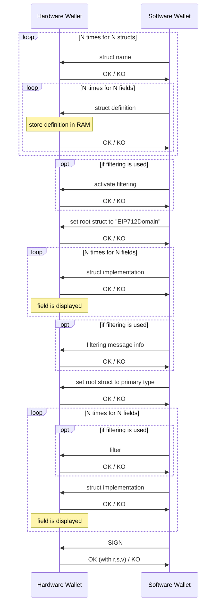

# EIP-712

## Specifications

https://github.com/ethereum/EIPs/blob/master/EIPS/eip-712.md


## Example message

```json
{
    "domain": {
        "chainId": 5,
        "name": "Ether Mail",
        "verifyingContract": "0xCcCCccccCCCCcCCCCCCcCcCccCcCCCcCcccccccC",
        "version": "1"
    },
    "message": {
        "contents": "Hello, Bob!",
        "from": {
            "name": "Cow",
            "wallets": [
                "0xCD2a3d9F938E13CD947Ec05AbC7FE734Df8DD826",
                "0xDeaDbeefdEAdbeefdEadbEEFdeadbeEFdEaDbeeF"
            ]
        },
        "to": {
            "name": "Bob",
            "wallets": [
                "0xbBbBBBBbbBBBbbbBbbBbbbbBBbBbbbbBbBbbBBbB",
                "0xB0BdaBea57B0BDABeA57b0bdABEA57b0BDabEa57",
                "0xB0B0b0b0b0b0B000000000000000000000000000"
            ]
        }
    },
    "primaryType": "Mail",
    "types": {
        "EIP712Domain": [
            { "name": "name", "type": "string" },
            { "name": "version", "type": "string" },
            { "name": "chainId", "type": "uint256" },
            { "name": "verifyingContract", "type": "address" }
        ],
        "Mail": [
            { "name": "from", "type": "Person" },
            { "name": "to", "type": "Person" },
            { "name": "contents", "type": "string" }
        ],
        "Person": [
            { "name": "name", "type": "string" },
            { "name": "wallets", "type": "address[]" }
        ]
    }
}
```

## Implementation



## Traversal

The traversal of the typed data with EIP-712 must follow the same order as the definition of the types. In the second
stage of the flow when receiving the implementation of the domain & message, there is no indication in
[the APDU](ethapp.adoc#eip712-send-struct-implementation) of which field the data is for since the app has knowledge of
all the types it knows the exact order to follow so it keeps track of which field comes next and does its error-handling
accordingly.

## Filtering

Filtering is used for a better clear-signing experience with EIP-712.
It started as a simple way to define which fields to show (with the ability to give them an easier to understand name)
with all the other ones hidden to prevent the user from having too many unrelevant fields to review, and it has now
evolved into something more complex which can apply formatting to the filtered fields.

It has to be defined with the ERC-7730 format like described [here](https://developers.ledger.com/docs/clear-signing/integration/metadata-file/EIP712-message).

It uses this optional APDU in the flow : [EIP712_FILTERING](ethapp.adoc#eip712-filtering).

## Streaming

The data is streamed to the device, and as there is a lot to store in RAM : all the struct definitions throughout the
entire flow, it was decided to use streaming, so the device starts the message review before having received everything.

This is very efficient with RAM, but this also means the code is more complex to handle this, testing also is because
it makes the navigation difficult with Ragger, and the error-handling is happening as the user is already reviewing the
message which is far from ideal.
