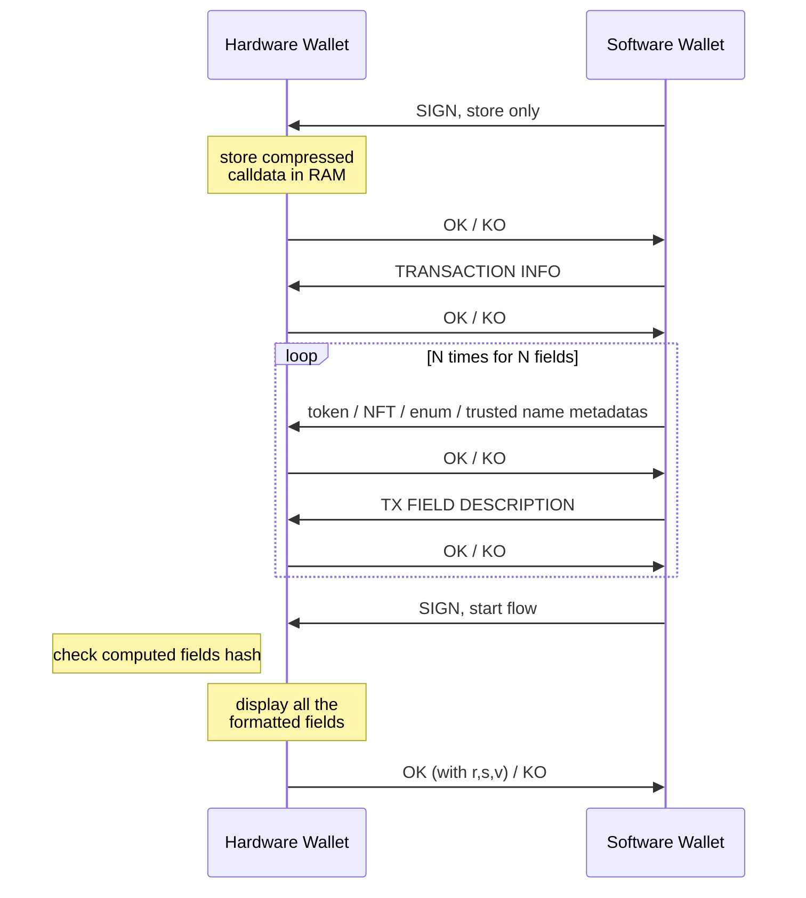

# Generic Clear-Signing

```mermaid
sequenceDiagram
    participant HW as Hardware Wallet
    participant SW as Software Wallet

    SW ->> HW: SIGN, store only
    note over HW: store compressed<br/>calldata in RAM
    HW ->> SW: OK / KO
    SW ->> HW: TRANSACTION INFO
    HW ->> SW: OK / KO
    loop N times for N fields
        SW ->> HW: token / NFT / enum / trusted name metadatas
        HW ->> SW: OK / KO
        SW ->> HW: TX FIELD DESCRIPTION
        HW ->> SW: OK / KO
    end
    SW ->> HW: SIGN, start flow
    note left of HW: check computed fields hash
    note over HW: display all the<br/>formatted fields
    HW ->> SW: OK (with r,s,v) / KO
```
